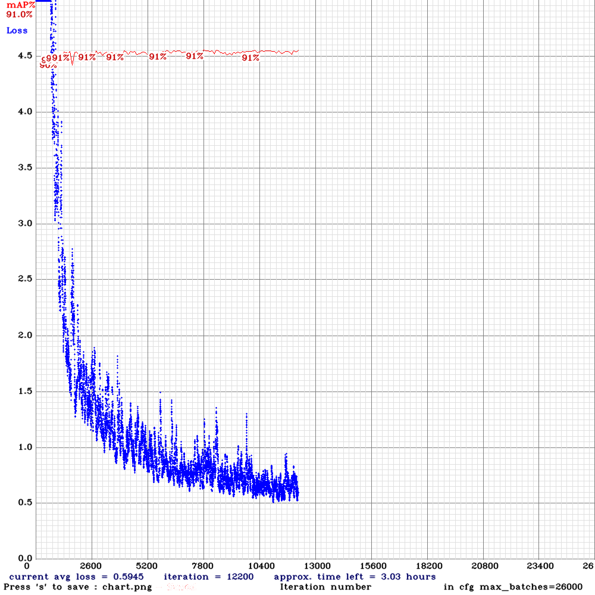
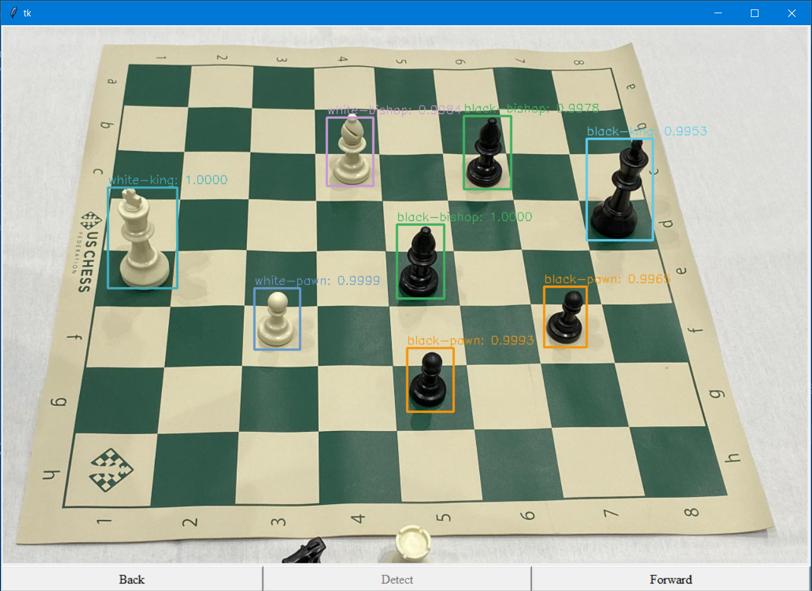

# Detect-Chess-Pieces 
Đây là một mini-project của tôi về detect quân cờ trên bàn cờ vua với 12 class: black-bishop black-king black-knight black-pawn black-queen black-rook white-bishop white-king  white-knight white-pawn white-queen white-rook. Được trên bằng model yolov3-tiny với total map khá ổn:

- Do model đã khá ổn với total map trên 90% và loss ở 0.5 nên t quyết định dừng train

# Requirement: 
- opencv, pillow và numpy 
- Tải file weight tại: https://drive.google.com/file/d/1-3sUiZtreezI-GTZarMRsHb_-32HykEQ/view?usp=sharing

# Giao diện:

